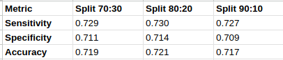
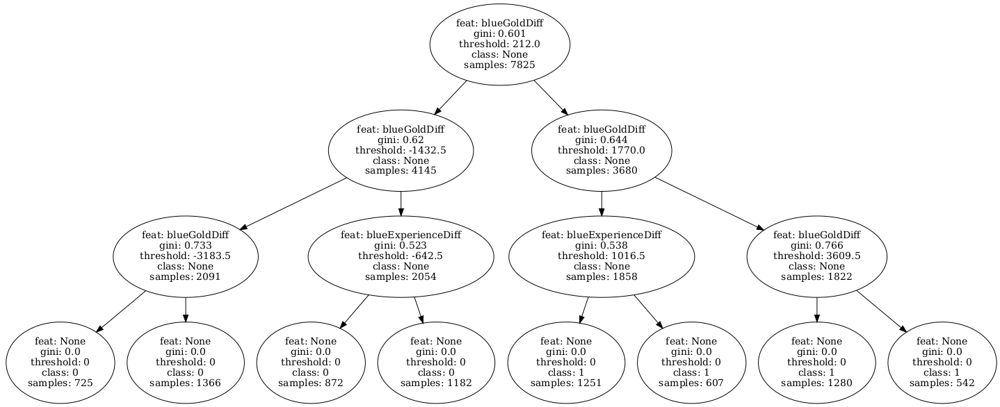

# LOL_10MIN_GAMES_PREDICTION

> [!IMPORTANT]
> Due to the specific versions of libraries used, the following version of Python is mandatory: **Python 3.10.12**

## Description
The dataset used for tree building and testing comes from Kaggle. You can find the full specification of the dataset here:
[League of Legends Diamond Ranked Games 10 Min](https://www.kaggle.com/datasets/bobbyscience/league-of-legends-diamond-ranked-games-10-min/data)

The project also contains a **DataTesting** module, which was used to determine the normality of the dataset and check the correlation of data attributes.

---

## Results
* **Number of data samples:** 9,879

### Performance across various data splits:
<p align="center">
  
</p>

### Example decision tree graph (MAX_TREE_DEPTH=4):
<p align="center">
  
</p>

---

## Notes
* The model input is explicitly for used dataset so are the constraints used but with a small amount of work, it can be aligned to any different dataset containing **numeric attributes only**.

---

## Usage

After cloning the repository, open your terminal in the root directory of the project. 
*(This step assumes you already have Python 3.10.12 installed)*

### 1. Environment Setup

**Linux / macOS:**
```bash
python -m venv venv
source venv/bin/activate
pip install -r requirements.txt
```

**Windows**

python -m venv venv
venv\Scripts\activate
pip install -r requirements.txt


### 2. Running Data Analysis

To display dataset analysis and generate statistics, run:
```bash
  python DataAnalysis.py
```
Script results include:

    A boxplot saved as a .png file for each dataset attribute under the plots/ directory.

    A stats.csv file containing statistical metrics for each attribute.

    A plot comparing the correlation of each attribute with the label attribute.

    A heatmap of attributes correlation


### 3. Training & Testing the Decision Tree

To train the model and evaluate its performance, execute:
```bash
  python main.py
```


